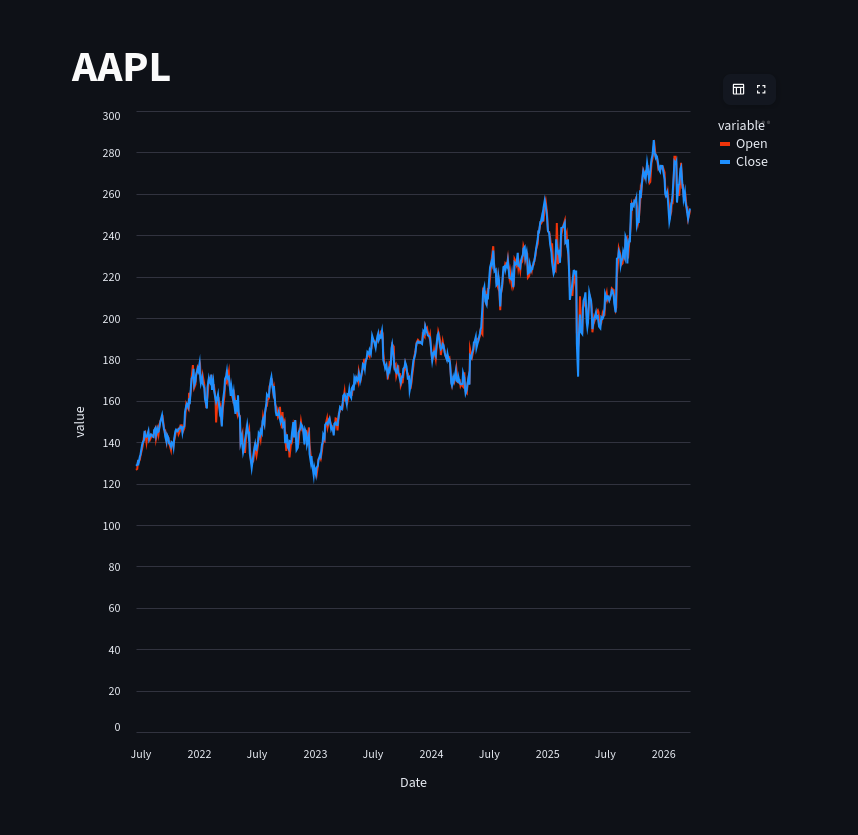

# Streamlit Data Lab 📊

Un espace d'expérimentation pour apprendre **Streamlit** à travers des projets d'analyse de données réelles, notamment sur les actions du S&P 500.

L'objectif de ce laboratoire est de manipuler des DataFrames, créer des visualisations interactives avec **Altair**, et structurer des dashboards analytiques performants.

---

## 🚀 Installation

### Prérequis
- **Python 3.8+**
- `pip` (gestionnaire de paquets Python)
- (Optionnel) Un environnement virtuel (`venv`)

### Configuration

1. **Cloner le dépôt**
   ```bash
   git clone https://github.com/Gw3nhael51/streamlit.git
   cd streamlit
   ```

2. **Créer et activer un environnement virtuel**
   ```bash
   python3 -m venv .venv
   # Sur Linux/macOS :
   source .venv/bin/activate
   # Sur Windows :
   .venv\Scripts\activate
   ```

3. **Installer les dépendances**

Il est recommandé d'utiliser le `Makefile` pour simplifier l'installation :
```bash
# Sur Linux/macOS :
make env-l
source .venv/bin/activate
make install

# Sur Windows :
make env-w
.venv\Scripts\activate
make install
```

---

## 📂 Données

Ce projet utilise un dataset S&P 500 (finances, prix, news, bilans) disponible sur [Kaggle](https://www.kaggle.com/datasets/sadiqguru/s-and-p-500-stock-data-along-with-financials-and-news).

Les fichiers doivent être placés dans le dossier `archive/` à la racine du projet :
- `archive/*.csv` (infos entreprises, bilans, etc.)
- `archive/price_data/*.csv` (données historiques de prix par ticker)

---

## 🛠️ Utilisation

### Lancer l'application
Le point d'entrée principal est `main.py`. Pour démarrer le serveur Streamlit via le `Makefile` :

```bash
make run
```

Ou manuellement :
```bash
streamlit run main.py
```

L'application sera accessible par défaut à l'adresse `http://localhost:8501`.

### Scripts disponibles
Actuellement, le projet est piloté par le `Makefile` :
- `make run` : Lance le dashboard interactif (Nvidia & Apple).
- `make install` : Installe/met à jour les dépendances.
- `make clean` : Nettoie les caches.

---

## ⚙️ Configuration & Environnement

- **Variables d'environnement** : Aucune variable d'environnement n'est requise pour le moment.
- **TODO** : Ajouter une gestion de fichiers de configuration pour les chemins de datasets si nécessaire.

---

## 🧪 Tests

- **État actuel** : Aucun test automatisé n'est implémenté pour le moment.
- **TODO** : 
    - [ ] Ajouter des tests unitaires pour la transformation des données avec `pytest`.
    - [ ] Ajouter des tests d'intégration pour vérifier le chargement des CSV.

---

## 🏗️ Structure du Projet

```text
streamlit/
├── main.py             # Point d'entrée principal (Navigation)
├── src/                # Code source modulaire
│   ├── modules/        # Pages du dashboard (Nvidia, Apple)
│   └── utils/          # Logique partagée (Données, Graphiques)
├── Makefile            # Automatisation (install, run, clean)
├── requirements.txt    # Dépendances Python
├── README.md           # Documentation
├── archive/            # Données CSV (non versionné)
└── assets/             # Ressources visuelles
```

---

## 💻 Stack Technique

- **Langage** : [Python 3](https://www.python.org/)
- **Framework Web** : [Streamlit](https://streamlit.io/)
- **Analyse de données** : [Pandas](https://pandas.pydata.org/)
- **Visualisation** : [Altair](https://altair-viz.github.io/)
- **Gestionnaire de paquets** : `pip`

---

## 📸 Aperçu


*Visualisation interactive des prix Open/Close pour AAPL.*

---

## 📝 Notes
Ce projet sert de laboratoire personnel pour tester Streamlit, structurer des dashboards et manipuler des données réelles dans un environnement simple et reproductible.
